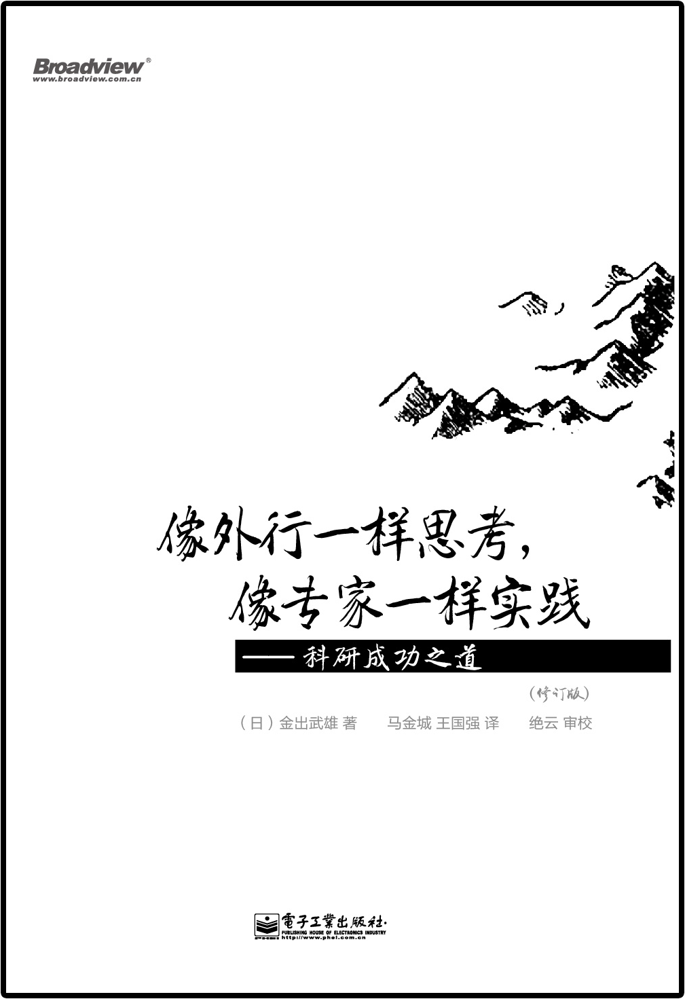

# 像外行一样思考，像专家一样实践(修订版)

## 图书信息

项目 | 信息
----|----
作者 | (日)金出武雄
出版社 | 电子工业出版社
副标题 | 科研成功之道
译者 | 马金城 / 王国强 
审校 | 绝云
出版年 | 2015-4
ISBN | 9787121250958

## 简介

这是14年回国后第一次参与翻译/审校的书. 原书初版在03年, 修订版这本13年在日本面世. 作者金出武雄是科研大拿, 曾任卡耐基梅隆大学机器人研究所所长. 全书围绕作者对科研/工作的方法论 "像外行一样思考, 像专家一样实践" 进行叙述, 通过科研现场丰富的例证给大家推广了这个论点.

相信这本书对科研 / 工作第一线的研究者或者工程师是有所裨益的.

## 链接

* [电子工业出版社](http://www.phei.com.cn/module/goods/wssd_content.jsp?bookid=42142)
* [豆瓣](http://book.douban.com/subject/26340523/)
