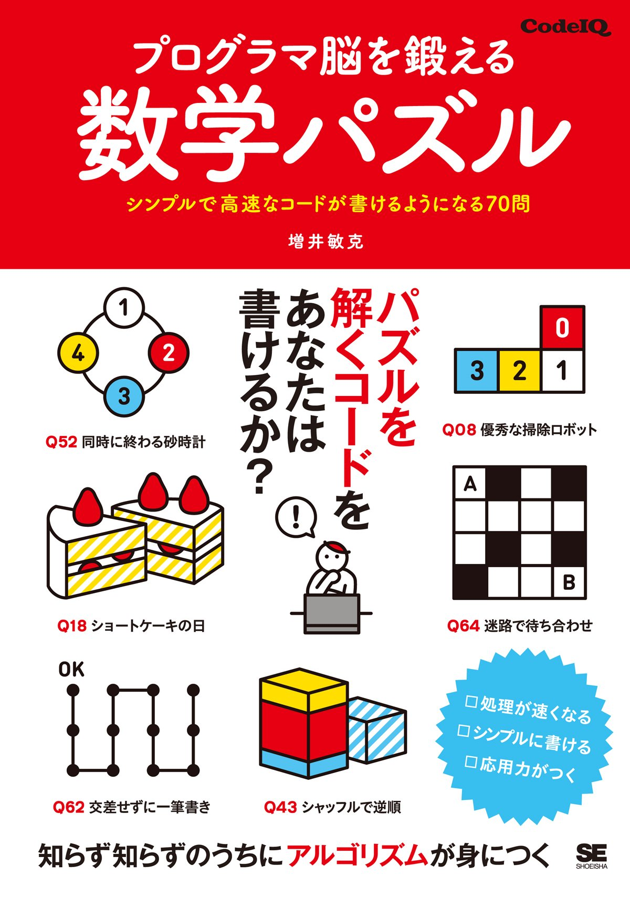

程序员的算法趣题
==============

## 图书信息

项目 | 信息
----|----
作者 | (日)増井敏克
出版社 | 人民邮电出版社
译者 | 绝云 
出版年 | 2016

## 简介

源自日本著名程序员刷题网站CodeIQ，通过70道贴近生活的数学趣题，向读者普及了相当精辟的算法理论和编程技巧。

## 链接

* [图灵社区](http://www.ituring.com.cn/book/1814)
* [amazon(原书)](https://www.amazon.co.jp/70/dp/479814245X)
