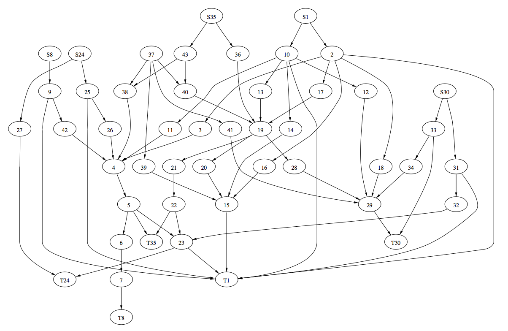
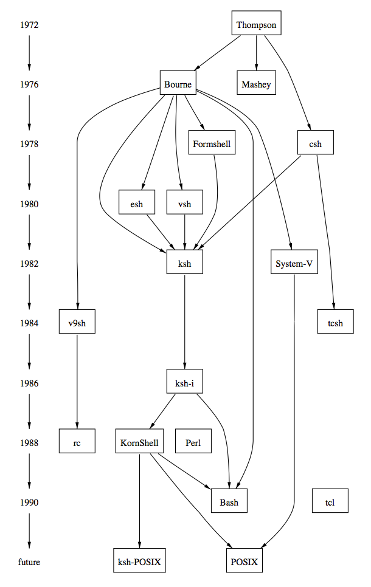
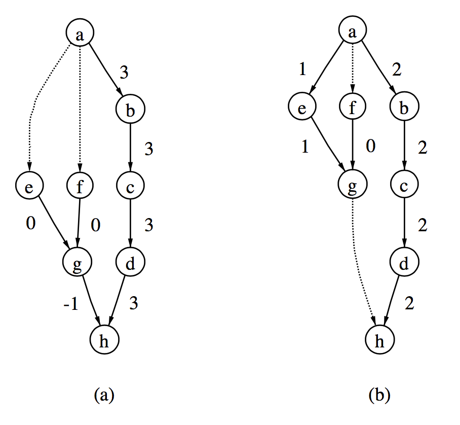
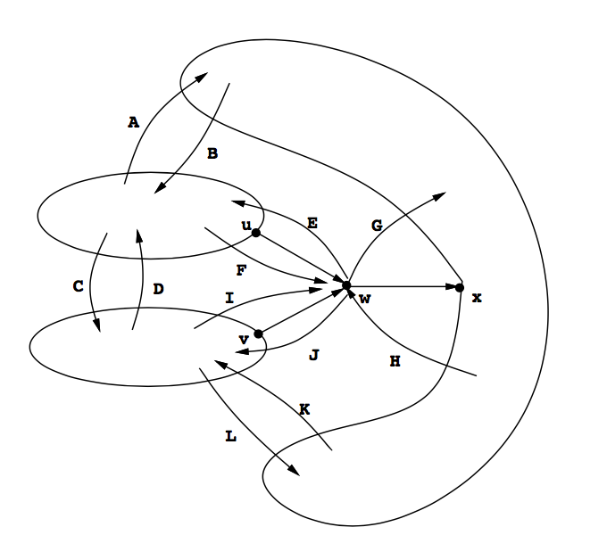
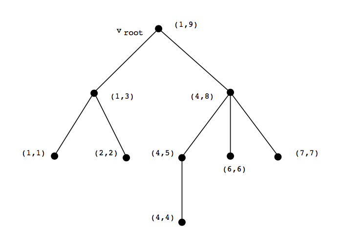
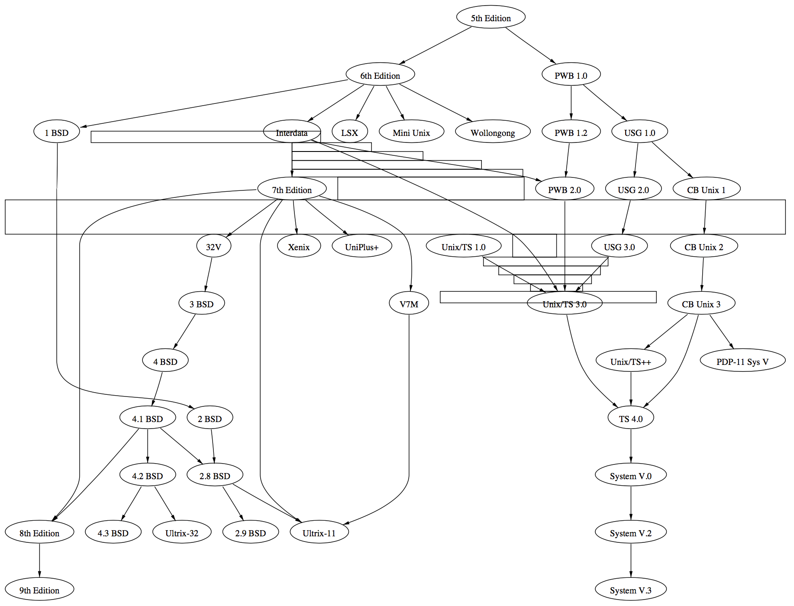
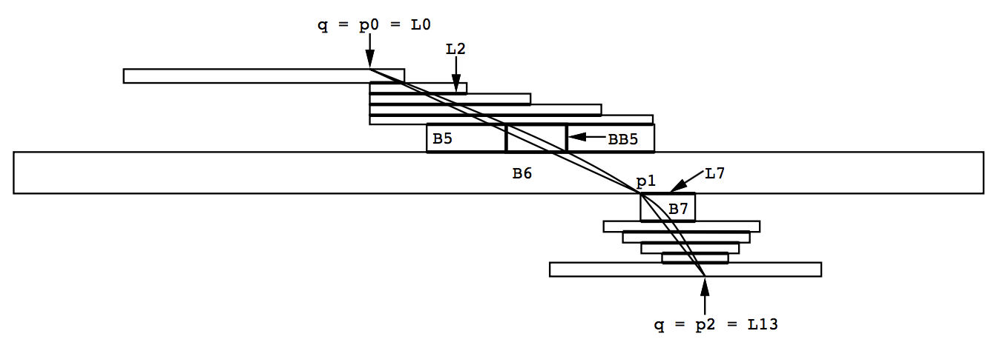
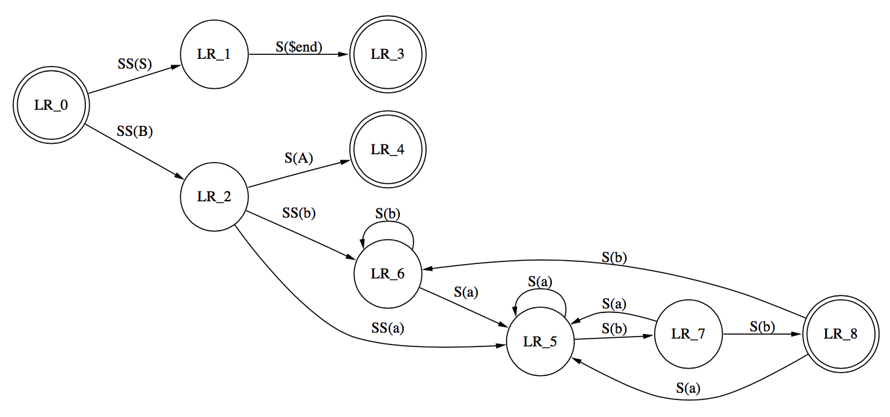

一种画有向图的技术
===============

## 原文信息

原文是AT&T贝尔实验室graphviz项目组沉淀的一篇论文，描述了graphviz中的dot布局所用的算法。

### 作者信息

```
Emden R. Gansner
Eleftherios Koutsofios
Stephen C. North
Kiem-Phong Vo

AT&T Bell Laboratories Murray Hill, New Jersey 07974
```

## 术语表（按字母顺序排序）

| 英文 | 中文 |
|---|---|
| B-spline | B样条 |
| backward edge | 后向边 |
| bounding box | 包围盒 |
| component | 组件 |
| convex hulls | 凸包 |
| cross edge | 交叉边 |
| cut value | 切值 |
| depth-first search | 深度优先搜索 |
| edge | 边 |
| flat edge | 同层级边 |
| forward edge | 前向边 |
| head/tail component | 头/尾分量 |
| head/tail port | 头/尾端口 |
| in-edge | 内向边 |
| incident edge | 入射边 |
| multi-edges | 重复边 |
| node | 节点 |
| non-tree edge | 非树形边 |
| out-edge | 外向边 |
| rank | 层级 |
| ranking | 排序 |
| self-edge | 自连边 |
| slack | 松弛度 |
| spline routing algorithm | 样条路由算法 |
| spline | 样条 |
| tangent vector | 切向量 |
| tree edge | 树形边 |
| vertex | 顶点 |


### 相关链接

- [原文](http://www.graphviz.org/Documentation/TSE93.pdf)
- [graphviz](http://www.graphviz.org/)
- [dot language](http://www.graphviz.org/pdf/dotguide.pdf)

## 摘要

本文描述了一种四步画有向图的算法。第一步用网络单纯形算法找出最优的节点层级分配。第二步用结合了新型加权函数和局部置换的迭代启发式算法为同一层级的顶点确定次序，以减少交叉。第三步通过构建和排序辅助图的方式确定最优的节点坐标。第四步通过计算样条来画边。这个算法能快速画出美观的有向图。

## 1. 引言

画抽象图是一个活跃的研究领域，其应用范围包括程序和数据结构可视化，以及文档准备等。本文描述了一种平面上画有向图的技术。目标是能找到快速画高质量图的方法，以供实时交互使用。这些算法是一个实际应用[^GNV1] 的基石。

### 1.1 美学标准

如果假设有向图有一个总体的流向或者方向，那么画图时会简单很多。譬如自顶向下（像本文大部分例子一样），或者从左往右。手绘的从起始状态到终止状态的有限状态机或者从输入到输出的数据流图中这样的流向很常见。这样的结论催生了基于以下美学准则的一系列有向图绘图方法。

- A1. 在图中展示层次结构。并且尽可能让所有的边指向同一个方向。这样有助于找出有向路径和定位起始和终止节点。
- A2. 避免和图无关的视觉异常。譬如要避免边的交叉和急转。
- A3. 尽量用短边。这样有助于定位关联节点和A2。
- A4. 倾向于对称和平衡。此标准在本文算法的某些环节中是次要的。

兼顾所有这些标准是不可能的。举个例子，A1决定的节点布局和边的方向也许会造成边交叉，从而违反了A2。并且，要最小化边交叉或者布局出对称的子图，会导致巨量的计算。所以本文作了一些简化的假设，并且依赖启发式算法以达到在普遍的情况下能快速得到一个美观的布局。读者如果需要进一步了解其他美学准则，可以参考Eades和Tamassia的注释书目中的画图算法[^ET]。

### 1.2 问题描述

画图算法的输入是一个可能包含环和多边的属性图$G=(V,E)$。假设$G$已连接，并且每个连接的组件可以单独列举。其属性如下。

| 表达式 | 含义 |
|---|---|
| $xsize(v)$, $ysize(v)$ | 节点v边界框的大小 |
| $nodesep(G)$ | 节点边界框之间最小水平间隔 |
| $ranksep(G)$ | 节点边界框之间最小竖直间隔 |
| $w(e)$ | 边e的权重，通常是1。权重代表边的重要程度，权重大的边在图中会更短并且竖直方向对齐 |

算法会在平面上为每个节点v分配一个矩形的中心点$(x(v),y(v))$，并给每条边生成一条B样条的控制点序列$(x_0(e),y_0(e)),...,(x_n(e),y_n(e))$。这些值都没有指定单位，根据经验，用72单位／英寸的坐标系统有助于实现。实际布局会遵循美学标准A1-A4以及图本身的属性。随后的章节会展示这些条件限制的细节。

算法还提供了画带活动表的图或者高亮起始终止节点的方法，用户可以据此进一步定制布局。下一章节描述的初始化步骤会把各个节点分配到互相独立的层级上（$0...Max\_rank$）。同一层级上的节点的$Y$坐标相等。用户还可以指定顶点集$V$的子集$S_{max},S_{min},S_0,S_1,...,S_k$。这些（可能是空集的）顶点集将会被各自强制分配到最大层级，最小层级或者某个统一层级上。

### 1.3 相关工作

Warfield[^Wa]最先提出使用启发式算法画有向图以减少边交叉，Carpano[^Ca]和Sugiyama，Tagawa以及Toda等人[^STT]也发现了类似的方法。Di Battista和Tamassia提出了一种所有边指向同一方向的平面布局有向图的算法[^DT]。本文算法是基于Warfield，Sugiyama等人工作之上的。

### 1.4 概述

如图1-1所示，本画图算法分四步。第一步把节点分配到各个独立层级上。第二步为每一层的节点排序，以减少边交叉。第三步确定节点的实际布局坐标。最后一步确定每条边的B样条控制点。

> 图1-1. 主算法

```
procedure draw_graph()
begin
    rank();
    ordering();
    position();
    make_splines();
end
```

本文的贡献在于

1. 使用网络单纯形算法高效地为节点指定层级
2. 使用一种优化的启发式算法减少边交叉
3. 为层级分配问题使用一种节点坐标计算方法
4. 一种指定样条控制点的方法

1和2种的方法最先在画图软件dag中实现[^GNV1]。进一步的工作，尤其是3和4被纳入dag的替代品dot[^KN]中。图1-2和1-3是dot的布局示例及其输入文件。

> 图1-2a. (Sun-4/28上用时1.11秒)



> 图1-2b. 图文件

```
digraph world_dynamics {
    size="6,6";
    S8 -> 9; S24 -> 27; S24 -> 25; S1 -> 10; S1 -> 2; S35 -> 36;
    S35 -> 43; S30 -> 31; S30 -> 33; 9 -> 42; 9 -> T1; 25 -> T1;
    25 -> 26; 27 -> T24; 2 -> 3; 2 -> 16; 2 -> 17; 2 -> T1; 2 -> 18;
    10 -> 11; 10 -> 14; 10 -> T1; 10 -> 13; 10 -> 12;
    31 -> T1; 31 -> 32; 33 -> T30; 33 -> 34; 42 -> 4; 26 -> 4;
    3 -> 4; 16 -> 15; 17 -> 19; 18 -> 29; 11 -> 4; 14 -> 15;
    37 -> 39; 37 -> 41; 37 -> 38; 37 -> 40; 13 -> 19; 12 -> 29;
    43 -> 38; 43 -> 40; 36 -> 19; 32 -> 23; 34 -> 29; 39 -> 15;
    41 -> 29; 38 -> 4; 40 -> 19; 4 -> 5; 19 -> 21; 19 -> 20;
    19 -> 28; 5 -> 6; 5 -> T35; 5 -> 23; 21 -> 22; 20 -> 15; 28 -> 29;
    6 -> 7; 15 -> T1; 22 -> 23; 22 -> T35; 29 -> T30; 7 -> T8;
    23 -> T24; 23 -> T1;
}
```

> 图1-3a. (Sun-4/28上用时0.5秒)



> 图1-3b. 图文件

```
digraph shells {
    size="7,8";
    node [fontsize=24, shape = plaintext];
    1972 -> 1976 -> 1978 -> 1980 -> 1982 -> 1984 -> 1986 -> 1988
        -> 1990 -> future;
    node [fontsize=20, shape = box];
    { rank = same;  1976 Mashey Bourne; }
    { rank = same;  1978 Formshell csh; }
    { rank = same;  1980 esh vsh; }
    { rank = same;  1982 ksh "System-V"; }
    { rank = same;  1984 v9sh tcsh; }
    { rank = same;  1986 "ksh-i"; }
    { rank = same;  1988 KornShell Perl rc; }
    { rank = same;  1990 tcl Bash; }
    { rank = same;  "future" POSIX "ksh-POSIX"; }
    Thompson -> {Mashey Bourne csh}; csh -> tcsh;
    Bourne -> {ksh esh vsh "System-V" v9sh}; v9sh -> rc;
           {Bourne "ksh-i" KornShell} -> Bash;
    {esh vsh Formshell csh} -> ksh;
    {KornShell "System-V"} -> POSIX;
    ksh -> "ksh-i" -> KornShell -> "ksh-POSIX";
    Bourne -> Formshell;
    /* ’invisible’ edges to adjust node placement */
    edge [style=invis];
    1984 -> v9sh -> tcsh ; 1988 -> rc -> KornShell;
    Formshell -> csh; KornShell -> Perl;
}
```

## 2. 最优层级分配

第一步是为$G$中的每一个节点$v$根据其边分配一个整数层级$\lambda(v)$。即对于边集$E$中的每一天边$e=(v,w),l(e)>=\delta(e)$，其中$e=(v,w)$的长度$l(e)$为$(\lambda(w)-\lambda(v))$，而$\delta(e)$表示某个指定的最小长度限制。$\delta(e)$通常是1，也可以是任意非负整数。由于下述技术上的原因，$\delta(e)$通常是内部指定的，用户如果想要调整层级分配，也可以从外部指定。在这一步中，每个非空的集合$S_{max},S_{min},S_0,S_1,...,S_k$会被临时合并成一个节点。另外，环会被忽略，多条边也会被合并为一条，并设置其权重为所有合并边权重之和。为提高性能，那些不从属于上述子集的叶子节点也会被忽略，因为这些叶子节点的层级可以很简单地通过最优层级分配指定。

### 2.1 图形去环

要有一个固定的层级分配，图一定不能存在环。而因为输入的图可能存在环，所以会有一个预处理步骤检测环并且通过反转某个边来去环[^RDM]。当然，这些边只是在算法内部被反转，最终画出来的图上箭头方向还是原来的方向。深度优先搜索在去环处理上很有用。输入图的边会从任意存在的起始节点或者终止节点按照其"原本"的顺序遍历。在深度优先搜索中，这些边会被分成两个集合：树形边和非树形边[^AHU]。树为部分节点指定了顺序，根据这些顺序，非树边会被进一步划分为三个子集：交叉边，前向边和后向边。交叉边连接的节点不在树节点中。前向边从树的一个节点连接到其后续节点上。后向边从树的一个节点连接到其祖先节点上。显然，向树形顺序中增加前向边和交叉边不会造成环。而所有后向边都会被转换成前向边，这个处理就破坏了所有的环结构。

显然，反转的边越少越好，最好是一个最小集。不过这里有个难点，要找出这个最小集（反馈弧集问题）是一个NP问题[^EMW] [^GJ]。更重要的是，找到一个最小集不一定有助于画图。我们实现了一个启发式算法去反转同时处于多个环中的边。这个算法每次随机取一个不同的强连通分量，对每个强连通分量，通过深度优先遍历计算每条边形成环的次数。成环次数最多的边会被反转。持续这个步骤直到不再存在强连通分量。

实验表明，绝大部分实际应用中产生的有向图，无论有环或无环，通过这个启发式算法都能得到相当自然的边方向。而输入的图通常正具备这种自然的指向。事实上，很多图正是由其他工具进行图搜索时产生。如果反转了不恰当的边，最终的图一定会受到影响。举个例子，程序调用图是可以有环的，而大家往往还是希望顶层的函数能画在图的上方，而不是图中间的某个地方。从算法稳定性上看，深度优先的启发式去环算法最合适不过。相比起把所有环内节点收缩为一个节点，或者把环内节点排布在同一层级，或者复制环中的某个节点等方法而言，这种算法能得到信息更齐备的图。此前多位研究者曾经证明过这个结论[^Ca][^Ro][^STT]。

有个实现的细节是，$S_{max}$和$S_{min}$表示的节点一定要分配最大和最小层级。要保证这一点，一定要尽可能反转$S_{max}$的连出边和$S_{min}$的连入边。并且，对于没有连入边的节点$v$，创建一条$\delta=0$的临时边$(S_{min}, v)$，对所有没有连出边的节点$v$，创建一条$\delta = 0$的临时边$(v, S_{max})$。这样一来，对所有的节点$v$，有$\lambda(S_{min})\leq\lambda(v)\leq\lambda(S_{max})$。

### 2.2 问题定义

A3原则倾向于画短边。抛开更好的布局效果不谈，短边还可以缩短后续依赖总边长的处理步骤所需的处理时间。因此，找出使得所有有权重的边长度最小的最优的节点层级分配是非常必要的。

而找出最优层级分配可以定义为以下整数规划问题：

$$
min_{(v, w)}\sum_{member E} \omega(v, w)(\lambda(w) - \lambda(v))
$$

$$
subject\: to: \lambda(v) - \lambda(w) \geq \delta(v, w) \forall (v, w)member E
$$

权重函数$\omega$和最小长度函数$\delta$会把边集合E分别映射成非负有理数和非负整数集合。

有不少方法可以在多项式时间内解决这个整数规划问题。其中一个是解决等效线性程序，然后把结果在多项式时间内转换成整数解。另一种办法是把最优层级分配问题转换成最小代价最大流问题或者网络流循环问题，这些问题都有多项式时间复杂度的算法（参见[^GT]及其索引）。因为约束矩阵完全是幺模的，这个问题应用网络单纯性算法可以在小于多项式时间复杂度内解决。相关技术更详尽的表述可以参考[^GNV2]。

### 2.3 网络单纯形

我们基于网络单纯形[^Ch]提出解决问题的一个简单算法。这个算法暂时还没有被证明为多项式时间复杂度，不过在实际应用中，这个算法迭代较少，速度也很快。

首先我们给出一些观测结果和定义。一个*可行*的层级分配必须使得所有的边$e$满足$l(e) \geq \delta(e)$。对于任意的层级分配，无论可行还是不可行，某条边的松弛度被定义为其长度和最小长度之间的差值。因此，对于某种层级分配方案，如果每条边的松弛度都为非负数，那么它是可行的。如果某条边的松弛度为0，那么它是紧凑的。

图的生成树对应着一个层级分配，或者一组层级分配（生成树是底层无根无向图，不一定是有向的树）。选取一个起始节点，配置其层级后，就可以得到一个层级分配。之后，遍历已分配层级节点的相邻节点，根据连线方向分配层级，上游节点层级递减，下游节点层级递增。重复这个过程，直到所有节点都被分配好层级为止。如果最终得到一个可行的层级分配，则这个生成树可行。从结构上看，可行生成树的连线都是紧凑的。

对给定的生成树，我们可以为树的每一条边按照如下规则指定一个切值。如果某条边被移除，那么树会被分成两个连通分量，尾分量包含边的尾节点，头分量包含边的头节点。切值为尾分量所有连向头分量的边，包括这条边本身的权重之和，减去头分量中连向尾分量的所有边的权重之和。

一般情况下（不总是，因为存在退化的情况）负的切值意味着这条边需要尽可能地延长，以使得加权边长度之和尽可能小，最终令头分量到尾分量的边变得紧凑。这和用紧凑边替代生成树中的边从而得到新的可行生成树的做法吻合。显然地，一种最优层级分配方案可以通过可行生成树推导出另一种最优层级分配方案。相对于纯代数范畴而言，在图形领域解决层级分配问题，这些观测是关键。把负切值的树边替换成恰当的非树边，直到所有树边都拥有非负切值为止。为确保这个过程能终止，实现方案理论上应该引入反循环技术，不过笔者实践过程中没有遇到过这个需求。最终得到的生成树可以推导出一个最优层级分配。关于网络单纯形终止问题和结果优化相关的文献可以参见[^Ch] [^Cu] [^GNV2]。

下图描述了论文中的网络单纯形算法。

> 图2-1. 网络单纯形

```
1. procedure rank()
2.     feasible_tree();
3.     while (e = leave_edge()) != nil do
4.         f = enter_edge(e);
5.         exchange(e, f);
6.     end
7.     normalize();
8.     balance();
9. end
```

图2-1.中的关注点

2: 函数`feasible_tree`生成了一个初始化的可行生成树。其具体流程如下所述。网络单纯形算法有一个可行方案开始，并且始终产生可行方案。

3: `leave_edge`返回一个切值为负的树边，如果没有，则返回nil，后者意味着已经是最优方案。所有负切值的边都会被选中并移除。

4: `enter_edge`会搜寻一条非树边替代边`e`。替代过程是先移除边`e`，这样树会被分为头分量和尾分量。程序会从所有从头分量连向尾分量的边挑选出最紧凑的一条。要保持可行，这一步是必不可少的。

5: 交换边，更新树和边的切值。

7: 最终方案通过把最低层级设置为0进行规范化。

8: 输入和输出边的权重相等，并且有几个不同的可行层级时，把它分配到节点最少的可行层级上。这一步的目的是遵从标准A4，降低拥挤程度，提高图的纵横比。这一步调整并不影响层级分配的效率。基于贪心策略的节点调整效率足够好。全局的层级均衡策略会在接下来的论文中讨论[^GNV2]。

> 图2-2. 生成初始化的可行生成树

```
 1. procedure feasible_tree()
 2.    init_rank();
 3.    while tight_tree() < V do
 4.        e = a non-tree edge incident on the tree
 5.            with a minimal amount of slack;
 6.        delta = slack(e);
 7.        if incident node is e.head then delta = -delta;
 8.        for v in Tree do v.rank = v.rank + delta;
 9.    end
10.    init_cutvalues();
11. end
```

图2-2.中的关注点

2: 找出一个初始的可行层级分配。为保持简洁，这里略去`init_rank`的具体实现。我们的算法是把所有节点存进一个队列中。所有边都已扫描的节点会保留到队列中，否则会从队列中提出来处理。提出来的节点会依据其所有连入边分配一个最小层级，并把其所有连出边标记为已扫描。在最简单的情况下，对所有边有$\delt = 1$，这时会把图看作偏序集，并把最小元素分配层级0。随后这些元素会被移除，新的最小元素集合则分配层级1，依此类推。

3: 函数`tight_tree`生成包含某些固定节点的紧凑边的最大生成树，并返回树的节点数。这里的最大生成树就是由固定节点通过紧凑边在底层无向图能到达的所有节点组成子图的生成树。所有这些书都具有相同的节点数。

4-8: 为树相邻的一个非树节点找到一条边，并调节树节点的层级，使得这条边紧凑。因为这被选择的边的松弛度一定是最小的，因此得到的层级分配仍然是可行的。从而在每次迭代后，最大紧凑树都会最少多得一个节点，从而算法最终能得到可行生成树。这里的算法实际上是Sugiyama等人提出的[^STT]。

10: `init_cutvalues`函数计算树边的切值。对每一条树边，计算切值时把节点分为头分量和尾分量，然后计算所有头和尾分别在不同分量内的边权重之和，其中，从头分量连向尾分量的边的权重设置为负值。

> 图2-3. 找到最优可行树



图2-3中展示了网络简单形算法的一个简单例子。图中虚线所示是非树边，所有边权重为1。a图展示的是分配了初始层级的图，其边的切值如图所示。举个例子，边$(g, h)$的切值为-1，表示边$(g, h)$（从尾分量连向头分量）的权重减去边$(a, e)$和边$(a, f)$（从头分量连向尾分量）的权重之和。b图中，负切值边$(g, h)$被非树边$(a, e)$替代，并标注了新所有树边的切值。此时所有边的切值均为正值，所以这个方案是最优的，算法结束。

### 2.4 实现细节

各种版本的网络简单形算法已经被深入研究过，文献里的研究成果[^Ch]可以作为实现的参考。不过我们还是觉得有必要为预期的算法实现者指出几个实现细节。这几个优化细节在这一步很有用，而到第4节我们应对更大的图而再次用网络简单形算法的时候，会变得至关重要。

实现网络简单形算法时，计算初始的可行树和切值往往会花费相当一部分的成本。对于实际的很多图而言，这个初始化方案已经接近最优，只需要几步迭代就能得到最终结果。在简单的实现里，初始的切值可以通过简单遍历边，移除每条边，对每个节点进行头分量和尾分量的分类，计算结果这几个步骤完成，时间复杂度为$O(VE)$。

为降低计算成本，我们注意到，如果可行树节点遍历是由叶子节点开始向上的，那么可以通过边局部的信息来计算切值。对于连接叶子节点的边，因为切分后头分量或者尾分量中只有一个节点，切值的计算是非常简单的。现在假设已知某个节点所连接的除了一条边以外，所有边的切值，那么剩余那条边的切值就等于已知切值之和加上节点所连非树边的权重。

图2-4中，两条树边已知切值，和第三条边共同连接到一个节点上，各自方向如图示。其他场景的处理类似。我们假设边$(u, w)$和$(v, w)$的切值已知。以大写字母标记的边是非树边，其方向、头尾所属联通量如图示。边$(u, w)$和$(v, w)$的切值分别为：

$$
C_{(u, w)} = \omega(u, w) + A + C + F - B - E - D
$$

以及

$$
C_{(v, w)} = \omega(v, w) + L + I + D - K - J - C
$$

此时，边$(w, x)$的切值为：

$$
\begin{aligned}
C_{(w, x)} & = \omega(w, x) + G - H + A - B + L - K \\
           & = \omega(w, x) + G - H + (C_{(u, w)} - \omega(u, w) - C -F + E + D) + (C_{(v, w)} - \omega(v, w) - I -D + J + C) \\
           & = \omega(w, x) + G - H + C_{(u, w)} - \omega(u, w) + C_{(v, w)} - \omega(v, w) - F + E - I + J
\end{aligned}
$$

最终的计算表达式仅仅涉及局部的边信息和已知边的切值。因此通过逐步计算切值，我们能保证每条边仅仅会被扫描两次，从而大幅度降低了计算出时切值的时间。

> 图2-4. 逐步计算切值



另一个有价值的优化是[^Ch]中描述过的技术，从某个固定根节点$v_{root}$开始执行后序遍历，并且对每个节点v，用$lim(v)$表示其后序遍历数，用$low(v)$表示其子孙节点中的最小后序遍历数，用$parent(v)$表示每个节点的父节点后序遍历数（见图2-5）。

> 图2-5. 后序遍历，节点上的标签为$(low, lim)$



这个算法提供了一种廉价的方式来检验某个节点是否在树边的头分量或者尾分量上，从而可以简单求证某个非树边是否头尾分属头分量和尾分量。举个例子，如果$e = (u, v)$是一个树边，而$v_{root}$在边的头分量中（也就是$lim(u) < lim(v)$），那么当且仅当$low(u) \leq lim(w) \leq lim(u)$时，节点w在尾分量中。这些数字也可以用在每次网络简单形迭代中高效地进行生成树更新。假设当前处理的边是$f = (w, x)$，那么需要更新切值的边都是生成树里和w和x相连路径上的边。这个路径可以通过回溯w和x的父节点，直到找到最近的共同祖先节点来确定，举个例子，就是第一个符合$low(l) \leq lim(w), lim(x) \leq lim(l)$的节点。当然，这些后序遍历参数在交换树连线的时候需要再次更新，不过都仅限于节点l的子节点下。

网络简单形算法的性能对于替代负切值边的选择也很敏感。经过实际观测，我们发现对所有树边进行循环搜索的效率会比每次对树边列表的从头开始搜索更高一些。

## 3. 层级内顶点排序

分配完层级之后，跨越多个层级的边会被替换成由多条连接临时节点或者“虚拟节点”的单位长度的边。虚拟节点被安插到中间层级上，使得整张图中所有边都只连接相邻层级的节点。这个步骤会忽略自连边，重复边也像上一步一样被合并。

每层中的顶点顺序决定了布局的边交叉情况，因此一个好的层级内顶点顺序应该要尽量少产生交叉边。因为对于分层图布局，即便只有两层，要使边交叉最小化，这是一个NP完全问题。因此这里适合采用启发式算法[^EMW]。

有几个减少分层图中边交叉的启发式算法都基于Warfield[^Wa]提出的下面这个方案。首先给出每一层节点的初始化顺序。然后执行一系列迭代尝试改进这个顺序。每次迭代从第一层遍历到最后一层，反之亦可。当访问某一层时，这一层每个顶点都会根据其关联的上一层顶点的位置分配一个权重。然后这一层的顶点会根据这个权重进行排序。

比较常用的两个顶点权重分配算法分别是重心法（barycenter function）[^STT]和中位数法（median function）[^EW]。令v为顶点，P为其相邻层级上相连顶点的位置列表。这里的位置指的是顶点在其层级上的顺序序号。重心法定义v的权重为P中元素的平均值。中位数法定义v的权重为P中元素的中位数。当P的元素个数为偶数时，中位数有两个。这就导致中位数法会有两个版本，一个版本总是采用左中位数，另一个版本总是采用右中位数。中位数法的表现始终比重心法要好，并且有轻微的理论优势。因为Eades和Wormald[^EW]研究表明，对两层的图而言，采用中位数的布局边交叉数最多不会超过最小边交叉数的3倍。而重心法并没有类似的研究结果。

我们的节点排序方法中位数法的改进版本，主要做了两个方面的优化。第一个是当有两个中位数的时候，我们倾向采用偏向更紧凑节点排布的内插值。第二个是采用一个启发式算法进一步减少排序后的明显边交叉，从而把指定排序转化成相对于顶点交换而言局部最优的排序。这个方法比起原方法大约减少了20-50%的边交叉数。更详细的统计数据读者可以参考[^GNV1]。

图3-1.展示了顶点排序算法。

> 图3-1. 顶点排序算法


```
 1. procedure ordering()
 2.     order = init_order();
 3.     best = order;
 4.     for i = 0 to Max_iterations do
 5.         wmedian(order,i);
 6.         transpose(order);
 7.         if crossing(order) < crossing(best) then
 8.             best = order;
 9.     end
10.     return best;
11. end
```

图3-1中的关注点

2: `init_order`初始化每个层级中的节点排序。这一步可以从最小层级的顶点开始，通过深度优先或者广度优先遍历来完成。遍历过程中，顶点通过由左往右的顺序来指定位置。这个策略保证了树图的初始化排序是没有边交叉的。这个策略很重要，因为树图产生的边交叉明显是可以避免的“失误”。

4-9: `Max_iterations`是最大迭代次数。我们设置这个常量为24。在每次迭代中，如果边交叉减少了，新的排序方案会被保存。在实际实现时，有人可能倾向采用自适应的策略，即只要过去几次迭代优化了几个百分点时，就继续迭代。`wmedian`通过启发式加权中位数法重新排序各层的节点。`transpose`会在能减少边交叉的时候交换同一层的两个相邻顶点。这些函数接下来会进一步论述。

图3-2展示了启发式的加权中位数算法。根据当前迭代次数的奇偶检验，各层级根据从上到下或者从下到上的顺序遍历。为简化例子，图3-2只展示了一个遍历方向的细节。

> 图3-2. 启发式加权中位数算法

```
 1. procedure wmedian(order,iter)
 2.     if iter mod 2 == 0 then
 3.         for r = 1 to Max_rank do
 4.             for v in order[r] do
 5.                 median[v] = median_value(v,r-1);
 6.             sort(order[r],median);
 7.         end
 8.     else ...
 9.     endif
10. end
11. procedure median_value(v,adj_rank)
12.     P = adj_position(v,adj_rank);
13.     m=P/2;
14.     if  P = 0 then
15.         return -1.0;
16.     elseif  P mod 2 == 1 then
17.         return P[m];
18.     elseif  P = 2 then
19.         return (P[0] + P[1])/2;
20.     else
21.        left = P[m-1] - P[0];
22.         right = P[ P -1] - P[m];
23.         return (P[m-1]*right + P[m]*left)/(left+right);
24.     endif
25.  end
```

图3-2中的关注点

1-10: 在前序遍历里，主循环从第1层开始遍历到最大层级。在每一层，每个顶点都会根据上一层级相邻顶点分配一个中位数。之后层级内的顶点会按照分配的中位数进行排序。一个重要的考量是如何处理和上一层级没有相邻顶点的顶点。在我们的实现里，这样的节点会被固化到它们原本的位置上，其它节点排序后分配到剩下的位置上。

12-26: 如果关联顶点的中位数只有一个，那么顶点的中位数就是这个值。否则就会被定义成根据紧凑程度定义为两个中位数的内插值。通常会采用更偏向紧凑顶点排布的一侧。

13: `adj_position`函数返回顶点v相邻层级的相邻顶点的有序位置序列。

15-16: 没有相邻顶点的节点中位数值被设置为-1。这是为了给排序函数标记，让这些节点维持原来位置。

图3-3展示了启发式的换位算法

> 图3-3. 减少边交叉的启发式换位算法

```
 1. procedure transpose(rank)
 2.     improved=True;
 3.     while improved do
 4.         improved=False;
 5.         for r = 0 to Max_rank do
 6.             for i = 0 to rank[r]-2 do
 7.                 v = rank[r][i];
 8.                 w = rank[r][i+1];
 9.                 if crossing(v,w) > crossing(w,v) then
10.                     improved=True;
11.                     exchange(rank[r][i],rank[r][i+1]);
12.                 endif
13.             end
14.         end
15.     end
16. end
```

图3-3中的关注点

3-15: 这是主循环，只要边交叉会减少，就会继续迭代下去。在排序函数的循环里，有一个自适应的策略会在边交叉减少量小到一定程度时结束循环。

7-12: 检测每一对相邻顶点。如果交换两顶点会使得边交叉数减少，则交换顶点。函数`crossing(v, w)`计算同一层级内，相邻的两个节点v与w（v在w左侧）的边交叉数。

有一个小的点是，原始图有可能存在同一层级节点之间的连线。我们称之为“同层级边”。根据A1原则，我们尝试把这些同层级边设置为同一方向。如果层级是由上而下排列的，那么同层级边通常会由左而右指向。这会给我们的顶点排序算法带来一些细微的变动。如果存在同层级边，那同层级边连接的顶点会在顶点排序时作为一个闭包。最终的顶点顺序必须包含这个排序的闭包。具体而言，闭包内两个顶点的初始顺序不能比改变，`transpose`和`sort`函数不能经过交换节点顺序破坏这个闭包内的排序。

当根据中位数排序节点或者交换相邻节点时，对比中位数值或者边交叉数会存在等值的情况。我们发现在每次前序或者后序遍历中排序或者交换等值的节点有助于遵从A4标准。

最后一点是通常运行两次顶点排序算法是值得的。第一次从最小层级开始遍历外向边，第二次是从最大层级开始，遍历内向边。这样可以从两种方案中找出更优的一种。

## 4. 节点坐标

第三部是计算节点坐标。之前的论文把计算节点坐标作为计算质心或者中心的后置步骤，为了布局的美观做一些局部的调整。我们将节点的位置作为一个独立的明确的问题，但是要为了更好的布局和未来的扩展性让步，例如顶点的排序是用拓扑算法还是几何算法。
X和Y坐标计算分两步进行。第一步是根据已经计算好的排序顺序，给所有节点分配X坐标(包括虚拟节点)。第二步是根据同样的排序顺序分配Y坐标。Y坐标的分配必须在节点的盒模型外维持最小的间隔$ranksep(G)$。当然，也可以调大邻近节点的间隔，增加邻近边的斜率，让整个图更具可读性。因为Y坐标的步骤很明确，所以这一小节的剩余部分会介绍如何计算X坐标。
根据之前提到过的审美原则，我们认为短而直的边比长而弯曲的边更好。X坐标计算存在如下的整数优化问题。

$$
min\sum_{e=(v,w)} \Omega(e) \omega(e) |x_w-x_v|
$$

$$
subject\: to: x_b-x_a>=\rho(a,b)
$$

其中$a$是$b$左边的邻近节点，有相同的排序值，并且$\rho(a,b)= (xsize(a)+xsize(b))/2 + nodesep(G)$
$\Omega(e)$是一个与输入的边权重$\omega(e)$不同的内部值，用于使计算出的边更倾向于长直线。由于两个邻近节点，相同排序值的边总是直线，减少节点之间的水平间距显得更加重要。因此，连线会在竖直方向上对齐，并且是直线。如果不这样做会导致一个"面条效应"，边会有许多不同的斜率。相应的，我们可以根据末尾的顶点将边分为三种不同的类型: （1）都是真实节点; (2)一个真实节点和一个虚拟节点;(3)都是虚拟节点。如果$e$,$f$,$g$分别是对应三种类型的边，那么$\Omega(e)<=\Omega(f)<=\Omega(g)$。我们实现的方式采用的值是1, 2和8。$rho$是计算相邻两个相同排序值的节点的中心之间最小间隔的函数。

现在已有将这个问题转化为一个线性程序的标准技术，添加辅助变量和不等量(inquality)来消除绝对值[Ch]。由于得到的限制完全是幺模的，用单纯性方法解出这个线性程序就为解决这个线性问题提供了思路，编程简单，给出的布局也符合审美。不幸的是这种变换把单纯形矩阵的大小从$VE$增加到了$2VE+E^2$.画少量的节点和连线的时候仅需数秒，但是大型的图会需要更久，甚至内存会成为一个局限。因此这并不是一个最优的布局方式。

### 4.1 启发式方法

这种方法用启发式程序替换现行程序来计算X坐标。启发式方法寻找一个“好”的初始位置，然后扫描上述的排序算法得到的排序值的节点，迭代的尝试优化这个位置。可以用以下为代表表示启发式方法。

> 图4-1. 给顶点分配X坐标

```
1.  procedure xcordinate()
2.      xcoord = init_xcord();
3.      xbest = xcoord;
4.      for i = 0 to Max_iterations do
5.      medianpos(i,xcoord);
6.      minedge(i,xcoord);
7.      minpath(i,xcoord);
8.      packcut(i,xcoord);
9.      if xlength(xcoord) < xlength(xbest) then
10.         xbest = xcoord;
11.     end
12.     return xbest;
13. end
```

2: 按照如下方式计算初始坐标集。对于每一个排序值，给最左边的节点分配坐标0。给其余每一个节点分配的坐标与前一个节点之间只满足最小间隔。因此，每个相同排序值的节点初始时都尽量靠左。

4-12: 在每个迭代，应用一系列的启发式方法优化坐标分配。如果当前迭代的结果优于之前的分配方案就保存这个方案。$xlength$是实现以上优化问题的目标函数。在我们的实现中，$Max_iteration$的值为8.

5: 中位数启发(median heuristic)基于当$x$的值为$x_i$的中位数的时候，$\left | x -x_0\right |+\left |x-x_1  \right | + \cdots + \left | x -x_i\right |$的值最小。这种启发方法按照每个节点的进和出的边的权重和给每个节点都分配一个最大和最小的优先级。在向下迭代时，节点根据最小优先级进行处理。将节点放到向下相邻节点的中位数位置，给更高优先级的节点和还没有分配坐标的节点让出空间。如果有两个中位数，用平均值对称优化(A4)。向上迭代也是相同的处理方式。

6: $minedge$与$medianpos$类似，但是只考虑连接两个真实节点之间的边。将边垂直放置，尽量靠近邻近边终端的节点的中位数。

7: $minnode$用一个队列，每次仅优化一个节点。一开始所有节点入队列。当一个节点从队列中移除时，将它尽量分配到离所有上层和下层节点的中位数最近的位置，同时也满足最小间隔函数$\rho$.如果节点的位置改变了，不在队列中的邻近节点也需要入队。$minnode$在得到局部最小时终止。

8: $minpath$逐个找到可能有相同X坐标的子链来优化虚拟节点的连线。

9: $packcut$从左到右扫描布局，寻找能压缩的区块。对于每个节点，如果所有在其右边的节点如果在不违背位置约束的情况下能被替换到左边，就进行替换。有一种算法用来处理这个操作，维护一个节点数组，根据X坐标排序。虽然这个算法在最坏情况下是$o(n^2)$的,但是在实际情况下表现很好。因为每个可能的裁剪都只需要搜索受影响的邻近节点。

这些启发式方法可以让我们快速得到很好的布局，但是他们实现很负责，而且有时候结果明显的不完美。进一步计算就比较困难，因为这些方法会有互相干扰。

### 4.2 最优节点放置

我们意识到$packcut$并不能找到所有可以压缩的子图来优化布局。我们考虑使用一个更加通用的启发式方法来查找字数并且进行转换。然后，我们发现这与网络单纯形算法移动整个子图查找最优的排序分配非常相似(具体可见第2节)。这意味着我们可以应用网络单纯形算法，用X坐标作为排行，找到最优的节点坐标。

这个方法包括构造如图4-2所示的辅助图。这种转换是上面提过到的图像相似性的代数转换，用于从优化问题中去除绝对值。辅助图的节点${G}'$是原图$G$。在$G$中的每一条边$e$,就有一个新节点$n_e$。在${G}'$中有两种边。一种对原始的边的代价进行编码(encodes the cost of the original edges)。在$G$中的每一条边$e=(u, v)$会被替换成两条边$(n_e, u)$以及$(n_e, u)$，$\delta = 0$,$\omega = \omega(e)\Omega(e)$。另一种边将同一序列的节点分开。如果$v$是$\omega$的左邻居，那么${G}'$就有一条边$f=e(_v_,_w)$,$\delta(f) = \rho(v, w)$,$\omega(f) = 0$.这条边将相对的节点充分的隔开，并且不影响整个布局的开销。

> 图4-2.


我们现在可以考虑$G'$的层级分配问题了。这个问题可以用网络单纯形方法解决。任何解决$G$的定位问题的方式与$G'$的层级分配问题是统一的。根据图4-2的方式给每个$n_e$分配$min(x_u, x_v)$的值，$x_u$和$x_v$是$G$中$u$和$v$的X坐标。相反的，$G'$里的任何层级分配都会催生一个$G$中的有效位置。另外，在最优的层级分配中，$e_u$或$e_v$中必须有一个长度为0，其他几个的长度为$\left | x_u -x_v\right|$.这说明了$G$中一条边$(u, v)$的开销等于$G'$中的两条边$e_u$和$e_v$的总和。通常这两种解法有相同的开销，因此，$G'$的最优解意味着$G$的最优解，$G‘$的解法也就是$G$的解决方式。

> 图4-3. 一个图中的节点连接桩


用辅助图也可以方便定义"节点连接桩"(node ports)，或者说是边的末端对于节点的中心的水平位移。这就让如图4-3的有向图扁平化成为可能。当计算图中节点的坐标时，边的长度必须包含连接桩的移位和到节点中心的距离。给出一条边$e=(u,v)$，$\Delta u$和$\Delta v$分别是水平方向上边的末端到$u$和$v$的中心的距离。$A\Delta$代表了连接桩在顶点中心的左侧。不失通用性的，假设$\Delta u \leq \Delta v$,让$d_e= \Delta v - \Delta u$。$d_e$是一个常量，因为它完全取决于节点的连接桩，而不是$u$和$v$的分配。我们现在可以解决相同的优化问题了，但是边的开销取决于$\Omega(e)\omega(e)\left | x_v -x_u+d_e\right|$。在辅助图中，我们设$\delta(e_u)=d_e$，$\delta(e_v)=0$。上述的问题可以扩展到$G$中的任何定位可以与$G'$的层级分配问题相统一，任何$G'$的最优的层级分配会催生一个$G$的有效定位。上面两个例子都说明了有：

$$
l(e_u)+l(e_v)=\left| x_v -x_u + d_e \right| + d_e
$$

对于$G$中所有的边$(u, v)$，$l$代表了$G'$层级分配中的长度度量函数。这个等式说明$G$和$G'$问题的最少开销总是因为常量$\sum_{ememberE} d_e$而不同。因此，$G'$的最小分配就相当于$G$的最小分配。图4-4的左半边举例说明了在辅助图中连接桩位移如何转换为边的$\delta$$值。右半边展示了原本的边的解决方式。

> 图4-4.


### 4.3 实现细节重审

辅助图比原始图大得多。假设原始图由$V$个节点，$E$条边，共$R$层，那么增加了虚拟节点的图共$V+D$个节点，$E+D$条边，其中$D$为虚拟节点个数。辅助图就有了$V+E+2D$个节点，$V+2E+3D-R$条边。辅助图应用网络简单形算法需要花费相当大的代价，因此第2节中关于网络简单形算法的优化点至关重要。

辅助图的结构可以简单地得到初始的可行树，可以利用这一点做进一步的优化。通过连接到同一层节点的所有边，可以构造一棵可行树。对每对相邻层级的节点，在$G'$中为树选取层级间的边$f = (u, v)$，以及$f_u$和$f_v$。这决定了两个层级所有节点的相对位置。最后，对于两层级间每一条边$e = (w, x) \neq f$，如果$w$或者$x$是最左侧节点，则把$e_w$或者$e_x$添加到树中。

如果没有这些优化，利用网络简单形算法放置节点需要花费5到10倍的时间。加上这些优化之后，我们的算法可以和启发式算法不相上下甚至更快。我们并不否定启发式算法也可以进一步进行优化，单网络简单形算法最大的优势在于实现代码更简单，并且能得到最优结果。另外，不少启发式算法中无法完成的优化可以轻易地在网络简单形算法中实现。举个例子，网络简单形算法完成后，我们可以通过遍历图来改善局部对称性（A4）。在不改变算法复杂度的情况下，检测切值为0的树边可以识别可调整的子图，从而调整子图，归一化子图入射边的松弛度。这可以提高对称性，例如让具有偶数个后代节点的节点居中。

## 5. 画边

我们使用样条曲线来画边。我们所知的画图软件通常使用折线，并且绝大部分不会处理线和无关节点相交的问题。虽然样条曲线实现起来更麻烦，但却可以得到更好的图，并且有助于满足A2标准。

在*dag*软件中，边样条由[^GNV1]中描述的启发式算法得到。这个算法会把虚拟节点之间的线段替换成不同的直线或者曲线线段。这个算法的缺点是，边有时候会因为在虚拟节点包围盒内转弯或者要避免穿过临近节点而发生急转。这样一来，虚拟节点在最终布局中变得可见。这个方法不能有效地利用可用空间。

最好能尝试找到两点之间避开其他节点或者边样条“障碍物”的平滑曲线。然后我们能把样条路由算法分成上半和下半部分。算法的上半部分计算布局中绘制样条的多边形区域。下半部分计算出这个多边形区域中的最佳样条布线。最后一步，调用上半部分根据样条的包围盒调节虚拟节点的大小，并且根据终端节点的形状边界裁剪样条。

图5-1中[^figure-5-1]有多边形区域和对应样条的例子。相关的边是从节点“Interdata”到“Unix/TS 3.0”的边。

更正式地，我们通过创建和解决以下子问题来绘制样条。给定$B_0, ..., B_m, q, \theta_q, r, \theta_r$，$B_i$为平行于坐标轴的方框，使得$B_i$具有和$B_{i-1}$和$B_{i+1}$相同的边。$q$和$r$分别是第一个和和最后一个方框上或者内部的点。找到$S_0, ..., S_n$和$BB_0, ..., BB_m$，其中$S_i$是分段贝塞尔曲线的控制点，$BB_i$是平行于坐标轴的方框。曲线的端点必须是$q$和$r$。$\theta_q$和$\theta_r$是可选的，如果被指定，则曲线必须在相应的端点处具有给定的斜率。$BB_i$对应于$B_i$，其定义是包含生成样条的最小方框。

接下来我们描述算法的两个部分。

### 5.1 确定区域

边可以分为三类：不同层级节点之间的跨层级边，同一层级不同节点间的同层级边以及自连边或者环。

> 图5-1. 样条的区域

> (Sun4-280上用时0.48秒)



#### 5.1.1 跨层级边

实际上，大多数的边都是连接不同层级节点的边。这样的边的区域在临近尾端口附近有几个方框，然后内部层级和虚拟节点处会交替排列方框，最后在头端口附近有几个方框。头和尾端口将边路由到节点适合的侧面。

为使边曲线尽可能平滑，样条应该能利用所有可用的空间。因此样条的区域不仅仅包含虚拟节点包方框，还可以包含邻近的任何可用空间。在计算样条结束后，虚拟节点方框会根据$BB_i$进行更新，此后样条将能利用所有剩余的空间，不过不能太接近已绘制的样条。因为样条的绘制是基于贪心策略，所以边的使用区域取决于其绘制顺序。尽早路由短边是更合理的，因为这些边通常能绘制成直线，不过绘制顺序对最终成图质量的影响似乎不大。

有三个细节可用改善样条的外观。首先，当边交叉的时候，边之间最好不要约束太多，否则其中一条可能会有一个尴尬的急转。通过调整方框可以简单地避免这个问题。设置方框大小的时候，可以忽略左右两侧在两个层级以内的虚拟节点。忽律更大范围的交叉是因为，如果方框因此而变得过于粗糙的话，可能会发生意料之外的多重交叉。

其次，如果边有一段几乎是垂直的，那么最后直接把这一段画成垂直线段。当有不同的边并排时，效果尤为明显，因为平行的线段看起来比几条斜率稍稍不同的长线更好。区域寻找过程检测到一个垂直的长段时，可以终止当前区域，绘制样条，绘制一段垂直的线段，最后再开始为剩余的部分继续寻找区域。这个处理是指定了$\theta_q$和$\theta_r$时的场景之一，因为样条在连接垂直线段的端点处必须具有一个垂直的切线。

再次，当几条样条接近共同的终点时，避免“意外”的交叉点很重要。为此，我们会检查是否有已绘制的具有相同端点的样条。如果有，我们会找出其中最接近的左边样条和右边样条。然后，我们划分层级内的空间，并按间隔评估左右样条。这些点（如果不存在左右样条，则是布局的边缘）会确定一组方框，使得新样条和已有样条在终止节点附近分离。图5-1中可以看到左右样条和决定绘制结果的方框。

这种层级内细分的方框可以看作不用和坐标轴对齐的多边形区域。在其他某些布局中，不对齐的方框或者多边形可以用于防止意外的切向。如果重写这个程序，我们可以尝试使用一般多边形来替代方框。

目前为止，我们还么有提到同一对节点之间的多条边。如果存在这样的边，其中某条边的样条会先计算出来，然后其他边可以通过彼此增加X坐标位移来绘制（位移设置成$nodesep(G)$的效果比较好）。第4节描述的上一步中，必须在节点之间为多条边留够足够的空间。

#### 5.1.2 同层级边

同层级边的处理和跨层级边类似，不过路由区域通过的是节点之间的调解节点和空白。因为处理过程类似，我们忽略掉大部分细节。其中一个区别是，如果是两个相邻节点之间的边，那么它将被绘制成具有以下控制点的样条曲线：

$$
\begin{aligned}
dx & = (x(u) - x(v)) \\
p0 & = (x(v, y(v) \\
p1 & = p0 + (\frac{1}{3}dx, 0) \\
p2 & = p0 + (\frac{2}{3}dx, 0) \\
p3 & = (x(u), y(u))
\end{aligned}
$$

对于同一对节点间的多条同层级边，为第一条边计算样条，而后增加Y坐标位移绘制其他边。如果边有标签文本，则标签位于边的中间位置。

#### 5.1.3 自连边

自连边在节点的一侧绘制为环。如果边指定了头或者尾端口，则生成连接两个端口的多边形区域。根据两端口的位置，区域会设置成顺时针或者逆时针方向。如果没有指定头尾端口，则边会绘制成两条样条序列，$p0, ..., p3$和$p3, ..., p6$。控制点如下所示：

$$
\begin{aligned}
dx & = nodesep(G) \\
dy & = \frac{1}{2}ysize(v) \\
p0 & = (x(v, y(v) \\
p1 & = p0 + (\frac{1}{3}dx, dy) \\
p2 & = p0 + (\frac{2}{3}dx, dy) \\
p3 & = p0 + (dx, 0) \\
p4 & = p0 + (\frac{2}{3}dx, -dy) \\
p5 & = p0 + (\frac{1}{3}dx, -dy) \\
p6 & = p0
\end{aligned}
$$

如果同一个节点有多条自连边，则自连边是嵌套的。如果有标签文本，则标签位于边的中间位置。在上述简单的场景下，标签位于点$p3$的右侧。如果是多条带标签的自连边，则标签的尺寸会加到边之间的位移中去，这样可以避免某条边穿过另一条边的标签。在第4节描述的上一步中，设置相邻节点间隔时，自连边所占的空间会提前分配好。

### 5.2 计算样条

计算样条有三个步骤。首先会计算一条完全包含在区域内的分段线性曲线或者路径。然后，该路径的端点会用作计算分段贝塞尔曲线时的提示。最后，曲线实际使用的空间会根据原始的方框进行计算。这三个步骤计算得到的数据结构如图5-4所示。这个图的区域和图5-1一样。这个例子里包含13个方框。

这三个步骤如图5-2所示。

> 图5-2. 计算样条

```
 1. procedure compute_splines (B_array, q, theta_q, use_theta_q, s, theta_s, use_theta_s)
 2.     compute_L_array (B_array);
 3.     compute_p_array (B_array, L_array, q, s);
 4.     if use_theta_q then vector_q = anglevector(theta_q)
 5.     else vector_q = zero_vector;
 6.     if use_theta_s then vector_s = anglevector(theta_s)
 7.     else vector_s = zero_vector;
 8.     compute_s_array (B_array, L_array, p_array, vector_q, vector_s);
 9.     compute_bboxes ();
10. end
```

图5-2中的关注点。

2: `compute_L_array`计算数组$L_0, ..., L_{m+1}$，其中$L_i$是方框$B_{i-1}$和方框$B_i$之间的线段。在图5-4中，这些线段显示为方框之间更粗的线条。共有14条这样的线段。

3: `compute_p_array`计算点的数组$p_0, ..., p_k$，这些点确定了连接$q$和$s$的可行路径。在图5-4中有3个这样的点。

4-7: 如果`use_theta_q`或者`use_theta_s`为真，则曲线会强制以指定的角度逼近相应端点。其中，`vector_q`和`vector_s`都是归一化向量。

8: `compute_s_array`计算点的数组$s_0, ..., s_k$，这些点定义一个连接q和s并完全包含在区域内的分段贝塞尔曲线样条。在最差的情况下，我们会在每一个方框内得到一条贝塞尔曲线样条。不过大多数情况下，我们的方法会产生较少的样条。譬如在图5-4中，只有2个样条，一个在$p_0$和$p_1$之间，一个在$p_1$和$p_2$之间。在更复杂的路径中，甚至可能样条的数目比线段少，因为与直线不同，曲线样条可以绕过障碍物。

9: `compute_bboxes`计算曲线实际占用的空间。它计算数组$BB_0, ..., BB_m$，其中$BB_i$是包围曲线$B_i$的最窄方框。

`compute_p_array`和`compute_s_array`都用分治法实现，如图5-3所示。

> 图5-3. 画样条

```
 1. procedure compute_p_array (B_array, L_array, q, s)
 2.     if line_fits (B_array, L_array, q, s) then return;
 3.     p = compute_linesplit (B_array, L_array);
 4.     addto_p_array (p);
 5.     compute_p_array (B_array1, L_array1, q, p);
 6.     compute_p_array (B_array2, L_array2, p, s);
 7. end
 8. 
 9. procedure compute_s_array (B_array, L_array, p_array, vector_q, vector_s)
10.     spline = generate_spline (p_array, vector_q, vector_s);
11.     if size (p_array) == 2 then
12.         while spline_fits (spline, B_array, L_array) == False do
13.             straighten_spline (spline);
14.     elseif spline_fits (spline, B_array, L_array) == False then
15.         count = 0;
16.         ospline = spline;
17.         repeat
18.             spline = refine_spline (p_array, ospline,
29.                                     mode (count, max_iterations));
20.             fits = spline_fits (spline, B_array, L_array);
21.             count = count + 1;
22.         while (fits == False) and (count <= max_iterations);
23.         if fits == False then
24.             p = compute_splinesplit (spline, p_array);
25.             compute_s_array (B_array1, L_array1, p_array1,
26.                             vector_q, vector_p);
27.             compute_s_array (B_array2, L_array2, p_array2,
28.                             reverse (vector_p), vector_s);
39.             return;
30.         endif
31.     endif
32.     addto_s_array (spline);
33. end
```

图5-3中的关注点。

2: `line_fits`检查由$q$和$s$定义的线是否完全包含在可行区域内。如果线和方框相交，那它要被剪切到每个方框中去。

3: 如果线$(q, s)$不适合，则`compute_linesplit`找到离$(q, s)$线最远的L线段，把`B_array`和`L_array`沿线段分割。点`p`是分割线段两个端点中距离线$(q, s)$更近的端点。举个例子，在图5-4中，路径被沿着$L7$分割。

4: `addto_p_array`把`p`添加到路径的端点数组中去。

5-6: 对`compute_p_array`的两次递归调用完成对路径的计算。`compute_p_array`不能保证路径最短，但这个函数工作得很好，我们还没有进一步研究它。如果这个函数举足轻重，可以用凸包在线性时间复杂度内计算最短路径[^Su]。

10: `generate_spline`计算逼近路径的贝塞尔曲线样条。这个计算由一个通用技术[^Gl]完成。

11-13: 首先处理路径中只有一个线段的情况。`spline_fits`检查样条是否完全被包含在区域内。对样条根据长度进行采样，然后将折线样本裁剪为与方框区域相对的线性路径。这个处理与`line_fits`类似。只要样条不合适，`straighten_spline`会调整样条控制点，减少曲率。在最坏的情况下，样条会变为一条适合路径的线。这种最坏的情况可能会产生急转。不过大多数情况下，样条在经过几次迭代后会适应区域，并且这个过程不会产生任何视觉异常。最坏的情况在区域本身就存在急转的时候才会发生。

14-30: 第二种情况是路径有多个线段。如果样条不合适，`refine_spline`会尝试调整控制点，使样条尽量拟合。这个方法类似第14-16行中的矫正方法。我们尝试降低样条的曲率。如果没有提高拟合度，那么我们会尝试提高曲率。这个过程可以永远持续下去，所以指定`max_iterations`为最大调用次数。`mode`返回一个标志位表明曲率需要提高还是降低。如果细化之后样条仍然没有拟合，那么我们拆解问题。`compute_splinesplit`找到路径上距离样条最远的线段的端点，并且根据端点分割方框和路径数组。对`compute_s_array`的两次递归调用得到两个分段贝塞尔曲线样条，每个样条都拟合该区域相应的部分。为使得两条曲线在分割点平滑连接，我们强制两个样条在分割点处具有相同的单位切向量。这保证了在分割点处的$C^1$连续性。强制得到$C^2$连续性似乎没有产生更好的结果，并且计算成本也高得多。矫正和细化的启发式算法之所以节省了大量时间，是基于以下假设：样条端点处的切向量可以独立于两个相邻样条的切向量。为得到$C^2$连续性，每当切向量被缩放时，相邻样条的切向量也必须被缩放，使得两个向量继续保持相同的长度。缩放可以一直传播到该区域的末端。此外，即使在缩放之后，其中一些样条也可能不拟合，这就需要进行更多的细分，包括单个方框内部的细分。这样就得不偿失了。

32: 最后，`addto_s_array`将样条曲线添加到分段贝塞尔曲线样条中去。

> 图5-4. 三个阶段



### 5.3 边标签

在*dag*软件中，边标签放置在样条中点的旁边。这是一个过分简化，因为对标签文本的排布没有任何避免甚至检测和其他样条、标签文本乃至节点的重叠的处理。不过大部分图的边标签文本都小而稀疏，所以这种技术有时候足够了。

在*dot*软件中，跨层级边的标签文本表示为偏离中心的虚拟节点。这个设计保证了标签文本和其他节点、边或者标签重叠。需要进行额外的调整才能使得添加标签文本不影响边的长度。设置最小边长为2（在创建虚拟节点的时候可令层级数翻倍），并让层级之间的间隔减半，以补偿标签节点。这样一来绘制带标签图形成本也至少会翻倍，但保证了标签的可读性。图5-5显示了边带标签文本的图。

自连边上的标签文本容易处理，但同层级边上的标签文本就更为复杂。这里，我们必须为标签文本的虚拟节点选择从左到右的顺序，使得其X坐标位于端点坐标之间，而不是左侧或者右侧。目前我们仍然在解决这个问题。

更复杂的图表（譬如地图）中标签文本排布问题是一个难题，值得更进一步去研究。不过值得一提的是，Freeman和Ahn所提及的标签文本排布程序[^FA]比我们整个画图程序还要大得多。

> 图5-5. 带状态转化标签的有限状态机

> （Sun-4/280上用时0.15秒）



## 6. 总结

我们描述了一种绘制有向图的方法。本文的贡献是网络简单形算法在分配层级和最终节点坐标的应用，一种改进的减少边交叉的启发式算法，一种计算边样条的方法。其中，分配节点坐标的方法允许边具有X坐标的端点位移。这些技术直观、易于编程实现，性能足以支持交互使用，并且绘图比前人的结果更具可读性和视觉上的美感。

更进一步的研究方向有：

- 了解如何修改图形或其布局能提高可读性
- 改进降低边交叉和画样条的启发式算法
- 允许不同布局步骤之间更多地进行交互。某一个阶段同等代价的不同解决方案也许会对下一阶段的结果造成很大的影响。举个例子，两种布局可能具有同样的边交叉数目，但最终的坐标相差很远
- 为动画支持增量（在线）画图。这方面从一个布局到下一个布局的稳定性是至关重要的

## 7. 致谢

感谢审稿老师对本文，尤其是第2节提出了详尽的意见，帮助我们理清了文脉。也感谢Guy Jacobson和Steve Lally对本文内容和风格上的批评和斧正。

## 联系方式

如果发现翻译问题，欢迎提出[issue](https://github.com/leungwensen/blog/issues/new)或者[pull request](https://github.com/leungwensen/blog/pulls)。也可以联系译者[绝云](https://github.com/leungwensen)和[青湳](https://github.com/elaine1234)

## 索引

[^AHU]:  Aho, A., J. Hopcroft, and J. Ullman, The Design and Analysis of Computer Algorithms, Addison-Wesley, Reading, Massachusetts, 1974.

[^Ca]:  Carpano, M., ‘‘Automatic display of hierarchized graphs for computer aided decision analysis,’’ IEEE Transactions on Software Engineering SE-12(4), 1980, pp. 538-546.

[^Ch]:  Chvatal, V., Linear Programming, W. H. Freeman, New York, 1983.

[^Cu]:  Cunningham, W. H., ‘‘A network simplex method,’’ Mathematical Programming 11, 1976, pp. 5-116.

[^DT]:  Di Battista, G., and R. Tamassia, ‘‘Algorithms for Plane Representations of Acyclic Digraphs,’’ eoretical Computer Science 61, 1988, pp. 175--198.

[^EMW]:  Eades, P., B. McKay and N. Wormald, ‘‘On an Edge Crossing Problem,’’ Proc. 9th Australian mputer Science Conf., 1986, pp. 327-334.

[^ET]:  Eades, P. and Roberto Tamassia, ‘‘Algorithms for Automatic Graph Drawing: An Annotated Bibliography,’’ Technical Report CS-89-09 (Revised Version), Brown University, Department of Computer Science, Providence RI, October 1989.

[^EW]:  Eades, P. and N. Wormald, ‘‘The Median Heuristic for Drawing 2-Layers Networks,’’ Technical Report 69, Dept. of Computer Science, Univ. of Queensland, 1986.

[^FA]:  Freeman, Herbert and John Ahn, ‘‘On The Problem of Placing Names in a Geographic Map,’’ International Journal of Pattern Recognition and Artificial Intelligence, 1(1), 1987, pp. 121-140.

[^GJ]:  Garey, Michael R. and David S. Johnson, Computers and Intractability, W. H. Freeman, San Francisco, 1979.

[^Gl]:  Glassner, Andrew S., Graphics Gems (editor), Academic Press, San Diego, 1990.

[^GNV1]:  Gansner, E. R., S. C. North and K.-P. Vo, ‘‘DAG - A Program that Draws Directed Graphs,’’ Software - Practice and Experience 17(1), 1988, pp. 1047-1062.

[^GNV2]:  Gansner, E. R., S. C. North and K.-P. Vo, ‘‘On the Rank Assignment Problem,’’ to be submitted.

[^GT]:  Goldberg, A. V. and R. E. Tarjan, ‘‘Finding minimum-cost circulations by successive approximation,’’ Mathematics of Operations Research, 15(3), 1990, pp. 430-466.

[^Ka]:  Karmarkar, N., ‘‘A new polynomial-time algorithm for linear programming,’’ Proc. 16th ACM STOC, Washington, 1984, pp. 302-311.

[^Kh]:  Khachiyan, L. G., ‘‘A polynomial algorithm in linear programming,’’ Sov. Math. Doklady 20, 1979, pp 191-194.

[^KN]:  Koutsofios, E., and S. North, ‘‘Drawing graphs with dot,’’ technical report (available from the authors), AT&T Bell Laboratories, Murray Hill NJ, 1992.

[^Ro]:  Robbins, G., ‘‘The ISI grapher, a portable tool for diplaying graphs pictorially,’’ Symboliikka ’87, Helsinki, Finland, also Technical Report IST/RS-87-196, Information Sciences Institute, Marina Del Rey, CA.

[^RDM]: Rowe, L. A., M. Davis, E. Messinger, C. Meyer, C. Spirakis, and A. Tuan, ‘‘A Browser for Directed Graphs,’’ Software - Practice and Experience 17(1), January, 1987, pp. 61-76.

[^STT]:  Sugiyama, K., S. Tagawa and M. Toda, ‘‘Methods for Visual Understanding of Hierarchical System Structures,’’ IEEE Transactions on Systems, Man, and Cybernetics SMC-11(2), February, 1981, pp. 109-125.

[^Su]:  Suri, Subhash. ‘‘A linear time algorithm for minimum link paths inside a simple polygon,’’ Computer Vision, Graphics, and Image Processing 35, 1986, pp. 99-110.

[^Ta]:  Tarjan, R. E. ‘‘Depth first search and linear graph algorithms,’’ SIAM Journal of Computing 1(2), 1972, pp. 146-160.

[^Wa]:  Warfield, John, ‘‘Crossing Theory and Hierarchy Mapping,’’ IEEE Transactions on Systems, Man, and Cybernetics SMC-7(7), July, 1977, pp. 505-523.

[^figure-5-1]: Graph data courtesy of Ian F. Darwin, SoftQuad Inc., and Geoffrey Collyer, Software Tool & Die.
