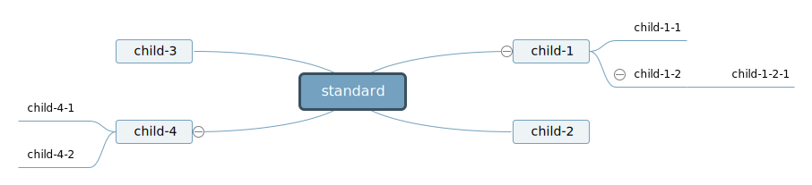
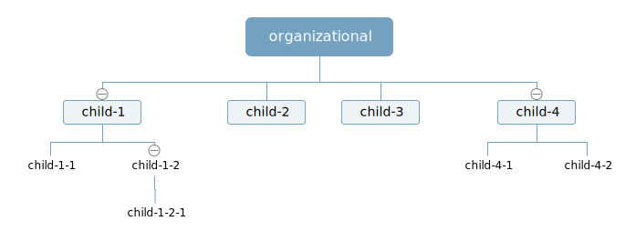
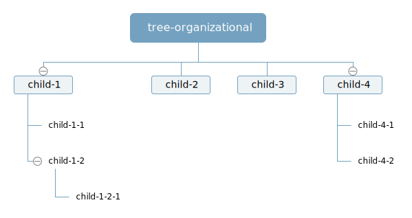
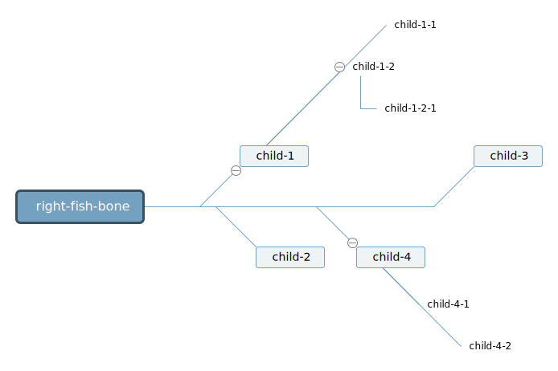
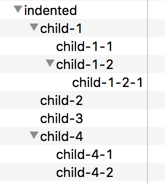

思维导图自动布局算法
=================

## 概述

为了让整理思路的过程更流畅，市面上的思维导图软件一般采用自动布局，使用户不必关心图形布局也能画出比较优美的思维导图。而为了用相对较小的代价（需要实时交互，实时布局）实现自动布局，常见的思维导图软件处理的图数据格式都是树形数据。本文以经典思维导图软件XMind接受的数据格式为例，汇总常见的思维导图自动布局算法。

### 输入

```javascript
{
  "topics": [ // 扁平化，用parent来表示思维导图节点上下级关系的数据结构
    {
      "label": "root",
      "id": "root"
    },
    {
      "label": "child-1",
      "id": "child-1",
      "parent": "root"
    },
    {
      "label": "child-2",
      "id": "child-2",
      "parent": "root"
    },
    {
      "label": "child-3",
      "id": "child-3",
      "parent": "root"
    },
    {
      "label": "child-4",
      "id": "child-4",
      "parent": "root"
    },
    {
      "label": "child-1-1",
      "id": "child-1-1",
      "parent": "child-1"
    },
    {
      "label": "child-1-2",
      "id": "child-1-2",
      "parent": "child-1"
    },
    {
      "label": "child-1-2-1",
      "id": "child-1-2-1",
      "parent": "child-1-2"
    },
    {
      "label": "child-4-1",
      "id": "child-4-1",
      "parent": "child-4"
    },
    {
      "label": "child-4-2",
      "id": "child-4-2",
      "parent": "child-4"
    }
  ],
  "links": [ // 上下级关系以外的额外连线
    {
      "source": "child-1-1",
      "label": "special link",
      "target": "child-2"
    }
  ]
}
```

### 输出

```javascript
{
	"nodes": [], // 带坐标信息的节点
	"edges": [], // 带起点终点坐标信息的边
}
```

## 算法汇总

### 标准布局 standard



#### 特点

1. Root节点的子节点先左后右布局。左边子节点后续节点往左，右边子节点后续节点往右。
2. Root节点的子节点围绕Root节点带向内的弧度紧凑布局。
3. Root节点后两层以后的子节点和所在层子节点垂直对齐（右边节点左对齐，左边节点右对齐）。
4. 布局时以Root节点为中心布局，布局完毕所有节点整体相对画布居中。

#### 使用场景

这种布局是经典的脑图布局，能比较直观地描绘发散的大脑思维，帮助人合并不同来源的资料，整理复杂的问题。

#### 算法描述


### 右向分层布局 rightHierarchical


#### 特点

1. 从左往右布局各个层次的节点。
2. 和经典的树图或者分层布局不同的地方在于，每个节点的位置只相对于父节点，和其他父节点不同的同层次节点位置不相关。

#### 使用场景

这种布局就是经典的树图层次结构布局，适合有明显分层的信息。譬如总结信息，族谱，目录结构和记录笔记等。

### 向下组织结构布局 downwardOrganizational



### 向下目录组织布局 downwardTreeOrganizational



### 右向鱼骨布局 rightFishBone



### 缩进布局 indented



<!--
### 向上组织结构布局 upwardOrganizational

### 向下分层布局 downwardHierarchical

### 左向鱼骨布局 leftFishBone

### 右向树布局 rightTree

### 左向树布局 leftTree

### 弧树布局 arcTree

### 肘树布局 elbowTree

### 水平时间轴 horizontalTimeline

### 垂直时间轴 verticalTimeline
-->
